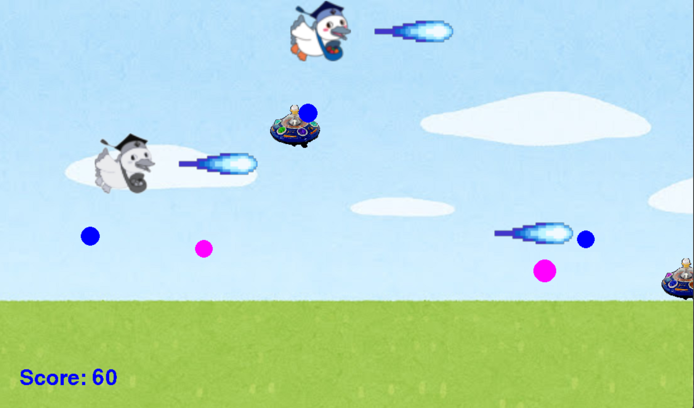

# こうかとんグラディウス

## 実行環境の必要条件
* python >= 3.10
* pygame >= 2.1

## ゲームの概要
* 主人公キャラクターコウカトンが横スクロールで敵機を破壊するゲーム

## ゲームの遊び方
* 矢印キーでコウカトン1P、wasdでコウカトン2pを操作し，自動により球を打つ
* 敵の攻撃を食らうと行動不能になり、1pと2p両方行動不能になるとゲームオーバー
* 一定時間経つとボスが出現。ボスを倒すとゲームクリア

## ゲームの実装
### 共通基本機能
* 背景画像と主人公キャラクターの描画
* 横スクロール
* 自動でビーム発射

### 分担追加機能
* ボス(担当：C0A23099):ボスのHPは20に設定。
* スピードアップ(担当：C0B23041)：敵を5体倒すとアイテムがドロップ。スピードがアップするぞ
* チャージショット(担当：C0A23083)：コウカトン1pがSPACE key、コウカトン2pが左SHIFTでチャージショットを放つ
* 二人プレイ(担当：C0A23079)：色ありがコウカトン1p、矢印キーで操作。白黒がコウカトン2p、wasdで操作。
* 敵のタイプを増やす(担当：C0A23067)、馬の敵：画面の端で止まった後に高速で移動する。爆弾を放つ敵：画面右端で爆弾を放つ

## TODO
* 行動不能のキャラに触れると、復活する。
* ファンネル・バリアの実装